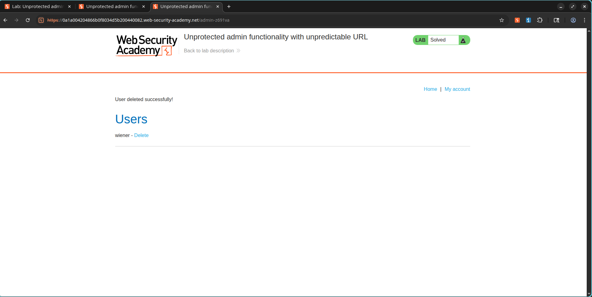

# The Admin URL Hidden in the Source Code

## The Challenge

I moved on to the next Access Control lab, and this one promised to be a step up from the last. Instead of leaking the admin panel through `robots.txt`, the application tried to hide it at an unpredictable URL. The task was to find that hidden URL, access the admin panel, and delete the user:

```text
carlos
```

* **Category:** Access Control
* **Level:** Apprentice
* **Lab:** Unprotected Admin Functionality with Unpredictable URL
* **Status:** Solved

---

## Where I Looked

Since the URL was supposed to be unpredictable, I knew it had to be disclosed somewhere. My first thought was to inspect the application's source code. I pulled up the homepage and hit:

```text
Ctrl + U
```

I started scrolling through the HTML and JavaScript, looking for anything that referenced an admin panel or administrative path.

---

## What I Found

Buried in the JavaScript code, I spotted this line:

```javascript
adminPanelTag.setAttribute('href', '/admin-z691va');
```

There it was. The "unpredictable" admin URL was sitting right there in the client-side code for anyone to read. The application was essentially playing hide-and-seek but leaving a map to the hiding spot.

### Screenshot


---

## Accessing the Administrator Panel

Using the discovered path, I navigated directly to:

```text
/admin-z691va
```

Just like the previous lab, the application granted unrestricted access to administrative functionality. No authorization checks, no role verification. I was in.

---

## Deleting the Target User

The administrator interface contained user management functionality. I found:

```text
carlos
```

and deleted him through the exposed administration panel.

---

## The Result

The target user was successfully deleted and the lab was marked as solved.

### Screenshot



---

## Why This Is Dangerous

This vulnerability allows an attacker to:

* Discover hidden administrative functionality.
* Bypass intended restrictions.
* Access privileged operations.
* Modify or delete sensitive application data.

---

## How to Fix It

If I were defending this application, I would:

* Enforce server-side authorization checks on all administrative endpoints.
* Do not rely on hidden or unpredictable URLs for security.
* Restrict privileged functionality using role-based access control.
* Remove sensitive administrative references from client-side code.

---

## What I Learned

This lab was a great reminder that security through obscurity is not security at all. The application tried to hide the admin panel by using a random-looking URL, but because that URL was hardcoded in the JavaScript, it was trivial to find. The real lesson is that client-side code is fully visible to anyone who knows how to view source, and hiding sensitive paths there is like putting your spare key under a doormat labeled "key here."

Key takeaways:

* Hidden URLs are not an access control mechanism.
* Client-side code should never contain sensitive administrative paths.
* Authorization must always be validated on the server.
* Security through obscurity should never be relied upon.

---

## References

* PortSwigger Web Security Academy
* OWASP Access Control Cheat Sheet
* OWASP Top 10 – Broken Access Control
