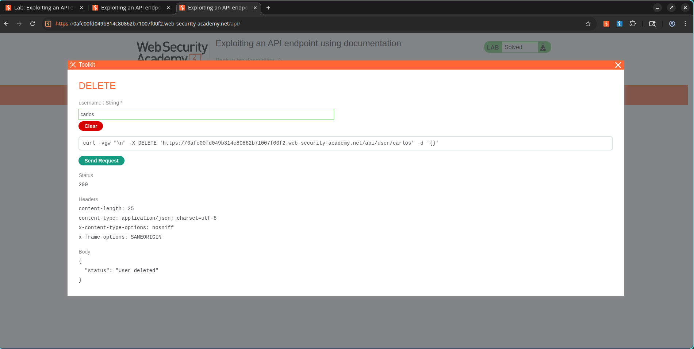

# How I Deleted a User by Reading the API Docs

## What I Was Up Against

This lab was about exploiting an API endpoint using exposed documentation. The goal was to find API docs that were left publicly accessible, figure out what endpoints existed, and then use one of them to delete the user `carlos`. It sounded straightforward, but I knew the trick would be finding the documentation in the first place.

- **Lab Name:** Exploiting an API endpoint using documentation
- **Category:** API Testing
- **Difficulty:** Apprentice
- **Platform:** PortSwigger Web Security Academy

---

## My Objective

The goal of this lab was to discover exposed API documentation, identify available API endpoints, and use the documented functionality to delete the user `carlos`.

---

## How I Figured It Out

I started by logging in with the provided credentials:

```text
Username: wiener
Password: peter
```

Once I was in, I navigated to the account page and updated my email address. I had Burp Suite running in the background, so I captured the request that went out when I saved the change. That request was my first look at how the API was structured.

---

### Step 1: Capture an API Request

I logged in using the provided credentials:

```text
Username: wiener
Password: peter
```

I updated the email address from the account page and captured the resulting API request.

#### Evidence


---

### Step 2: Discover API Documentation

The captured request targeted:

```http
PATCH /api/user/wiener
```

By modifying the endpoint path and exploring the API structure, I discovered the exposed API documentation endpoint.

The documentation revealed available API operations and request formats.

#### Evidence


---

### Step 3: Abuse Documented Functionality

Using the interactive API documentation, I identified the following endpoint:

```http
DELETE /api/user/{username}
```

I supplied the username parameter with:

```text
carlos
```

The request successfully deleted the target account.

---

## What Happened in the End

The privileged API functionality was accessible through exposed documentation, allowing deletion of arbitrary users.

### Evidence



---

## Why This Matters

Exposed API documentation can significantly aid attackers by:

- Revealing hidden endpoints
- Exposing administrative functionality
- Providing request formats and parameters
- Simplifying endpoint enumeration
- Enabling privilege escalation and unauthorized actions

---

## What I Learned

- API documentation should not be publicly accessible unless required.
- Administrative API endpoints must enforce proper authorization checks.
- Hidden functionality should not rely on obscurity for protection.
- Regular API security reviews should include documentation exposure assessments.

---

## Screenshots Used

```text
images/
├── api_user_request.png
├── api_documentation.png
└── lab_solved.png
```

## Lab Status

✅ Solved
