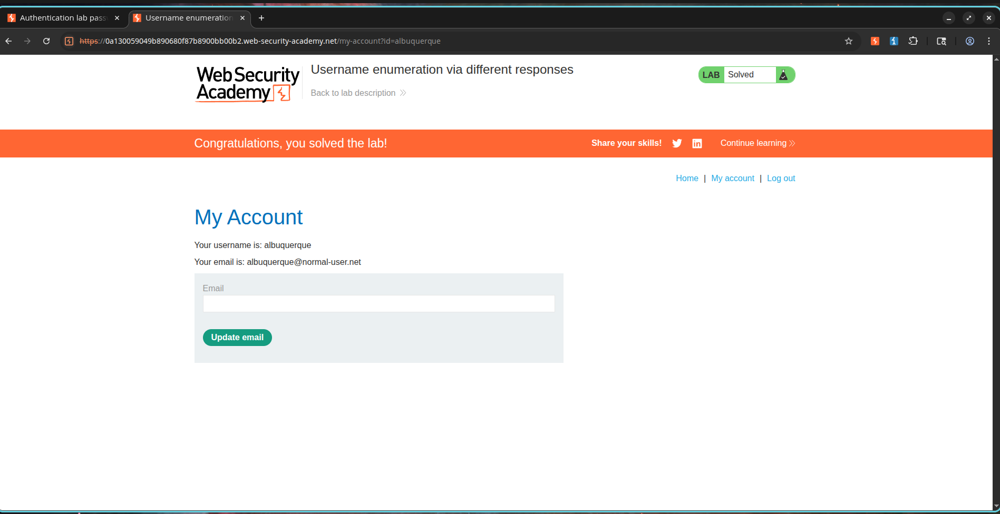

# How I Cracked a Login Form with Nothing But Error Messages

## What Caught My Eye

I was working on an authentication lab from PortSwigger when I noticed something interesting about the login page. The application was leaking information through its error messages, and it didn't even try to hide it.

When I submitted an invalid username, the application responded with:

```text
Invalid username
```

But when I submitted a valid username with the wrong password, it responded with:

```text
Incorrect password
```

That small difference was the key. The application was telling me whether a username existed just by the error message it returned. Once I found a valid username, I could focus my brute-force efforts on just that account instead of guessing blindly.

---

## How I Broke It Down

### Phase 1: Finding a Valid Username

I started by navigating to the login page and submitting a login request with some arbitrary credentials. I intercepted the request with Burp Suite and sent it over to Burp Intruder.

I placed the payload position on the `username` parameter, loaded up the provided candidate username list, and launched the Intruder attack.

As the results came in, I compared response lengths and messages. Most responses said:

```text
Invalid username
```

But one stood out. For the username `albuquerque`, the response contained:

```text
Incorrect password
```

That told me the username existed in the system. I recorded it and moved on to the next phase.

---

### Phase 2: Finding the Password

Now that I had a valid username, I replaced the username parameter with `albuquerque` and moved the payload position to the `password` parameter. I loaded the provided candidate password list and launched another Intruder attack.

This time, I watched the response status codes closely. Most attempts returned the usual error, but one password generated a different response:

```text
302 Found
```

That redirect meant successful authentication. The password was `batman`.

I recorded it and prepared to log in for real.

---

### Phase 3: Getting In

I went back to the login page, entered the credentials I had discovered, and logged in. I was redirected to the user account page and the lab marked itself as solved.

---

## Proof of Concept

### Valid Username I Found

```text
albuquerque
```

### Valid Password I Found

```text
batman
```

### Enumeration Indicator

Invalid users generated:

```text
Invalid username
```

Valid user generated:

```text
Incorrect password
```

### Authentication Indicator

Successful login generated:

```http
HTTP/2 302 Found
Location: /my-account?id=albuquerque
```

---

## Screenshots

### Screenshot 1 – Username Enumeration

**Description:**

Burp Intruder attack against candidate usernames. The response for the username `albuquerque` differed from all other responses and contained the message:

```text
Incorrect password
```

indicating that the username exists within the application.


---

### Screenshot 2 – Password Discovery

**Description:**

Burp Intruder attack against candidate passwords for the identified username. The password `batman` generated a `302 Found` response, indicating successful authentication.


---

### Screenshot 3 – Successful Authentication

**Description:**

Successful login using the identified credentials and completion of the PortSwigger lab.



---

## Impact

This kind of vulnerability has serious implications:

* Disclosure of valid usernames.
* Enables targeted password brute-force attacks.
* Reduces attack complexity for authentication attacks.
* Increases the likelihood of account compromise.
* May lead to unauthorized access to sensitive user data.
* Can facilitate privilege escalation if administrative accounts are identified.

---

## How to Fix It

1. Return generic authentication error messages for all login failures.

Example:

```text
Invalid username or password
```

2. Implement account lockout policies after multiple failed login attempts.
3. Enforce strong password policies.
4. Enable Multi-Factor Authentication (MFA).
5. Implement rate limiting on authentication endpoints.
6. Monitor and alert on suspicious authentication activity.
7. Use CAPTCHA mechanisms where appropriate.

---

## CVSS Score

**CVSS v3.1 Score:** 5.3 (Medium)

### Vector

```text
CVSS:3.1/AV:N/AC:L/PR:N/UI:N/S:U/C:L/I:N/A:N
```

---

## CVSS Justification

### Attack Vector

Network (N) – Exploitable remotely via web requests.

### Attack Complexity

Low (L) – No special conditions are required.

### Privileges Required

None (N) – No authentication is needed.

### User Interaction

None (N) – No victim interaction is required.

### Scope

Unchanged (U) – Impact remains within the vulnerable application.

### Confidentiality Impact

Low (L) – Valid usernames can be disclosed.

### Integrity Impact

None (N) – No data modification occurs.

### Availability Impact

None (N) – No disruption to service is required.

---

## References

* OWASP Authentication Cheat Sheet
* OWASP Credential Stuffing Prevention Cheat Sheet
* PortSwigger Web Security Academy – Username Enumeration via Different Responses
