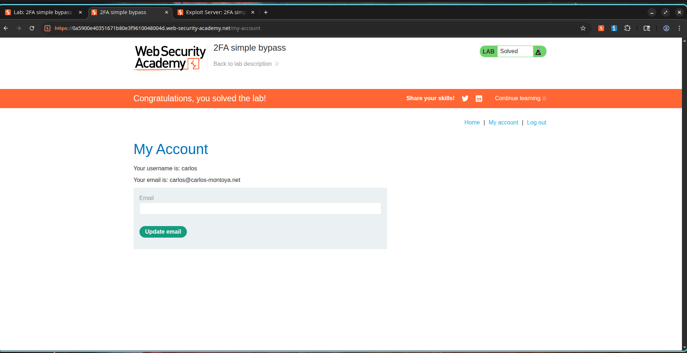

# How I Bypassed Two-Factor Authentication by Just Changing the URL

## What I Was Looking At

I was working on a PortSwigger lab about two-factor authentication, and the setup looked pretty standard at first. After entering a valid username and password, the application redirected me to a 2FA verification page where I was supposed to enter a security code.

But something felt off. I started wondering: what if the application wasn't actually enforcing the 2FA step before letting me into the account? What if I could just skip it?

---

## How I Tested the Normal Flow First

### Phase 1: Seeing How It Was Supposed to Work

I navigated to the login page and logged in with my own credentials:

```text
Username: wiener
Password: peter
```

Sure enough, the application redirected me to a 2FA verification page. I checked the email client, grabbed the verification code, submitted it, and got access to the account page. So far, so good.

---

## Then I Tried to Break It

### Phase 2: The Bypass

I logged out and decided to try something sneaky. I logged in using the victim credentials:

```text
Username: carlos
Password: montoya
```

The application redirected me to the same 2FA verification page. But this time, I didn't enter the verification code. Instead, I manually changed the URL in my browser from:

```text
/login2
```

to:

```text
/my-account
```

I hit Enter, and to my surprise, it worked. I was granted full access to the victim's account without ever completing the second authentication factor.

---

## Proof of Concept

### Valid Credentials

```text
Username: carlos
Password: montoya
```

### Expected Secure Flow

```text
Login
   ↓
2FA Verification
   ↓
Account Access
```

### Actual Vulnerable Flow

```text
Login
   ↓
2FA Verification
   ↓
Direct URL Access (/my-account)
   ↓
Account Access Granted
```

### Vulnerable Resource

```http
GET /my-account HTTP/2
```

The application failed to verify whether I had successfully completed the second authentication factor before granting access to the protected account page.

---

## Screenshots

### Screenshot 1 – Normal 2FA Verification Page

**Description:**

After successful login using valid credentials, the application redirects the user to the 2FA verification page and requests a security code.


---

### Screenshot 2 – Victim Account 2FA Challenge

**Description:**

The victim account (`carlos`) is redirected to the same 2FA verification page after successful credential validation.


---

### Screenshot 3 – Successful 2FA Bypass

**Description:**

I manually navigated to the account page without providing a valid security code and successfully gained access to the protected account.



---

## Impact

This vulnerability is serious because it allows:

* Complete bypass of multi-factor authentication.
* Unauthorized access to user accounts.
* Increased risk of account takeover.
* Reduced effectiveness of authentication security controls.
* Exposure of sensitive user information.
* Potential privilege escalation if administrative accounts are targeted.

---

## How to Fix It

1. Enforce server-side validation of the 2FA completion state.
2. Verify successful second-factor authentication before granting access to protected resources.
3. Associate authentication state with server-side sessions.
4. Restrict direct access to protected endpoints until 2FA verification is completed.
5. Implement centralized authorization checks across all authenticated routes.
6. Perform regular authentication security reviews and penetration testing.

---

## CVSS Score

**CVSS v3.1 Score:** 8.1 (High)

### Vector

```text
CVSS:3.1/AV:N/AC:L/PR:N/UI:N/S:U/C:H/I:H/A:N
```

---

## CVSS Justification

### Attack Vector

Network (N) – Exploitable remotely through web requests.

### Attack Complexity

Low (L) – The bypass requires only URL manipulation.

### Privileges Required

None (N) – Only valid credentials are needed, which are assumed compromised.

### User Interaction

None (N) – No victim interaction is required.

### Scope

Unchanged (U) – Impact remains within the vulnerable application.

### Confidentiality Impact

High (H) – Sensitive account information can be accessed.

### Integrity Impact

High (H) – Unauthorized actions can be performed on behalf of the victim.

### Availability Impact

None (N) – The attack does not affect service availability.

---

## References

* OWASP Multifactor Authentication Cheat Sheet
* OWASP Authentication Cheat Sheet
* PortSwigger Web Security Academy – 2FA Simple Bypass
