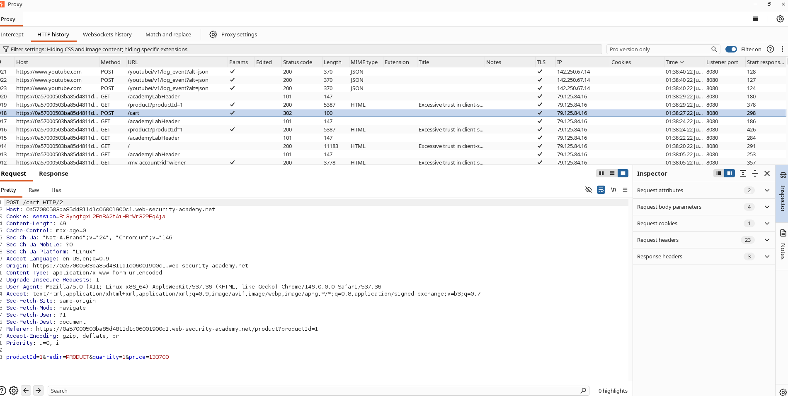
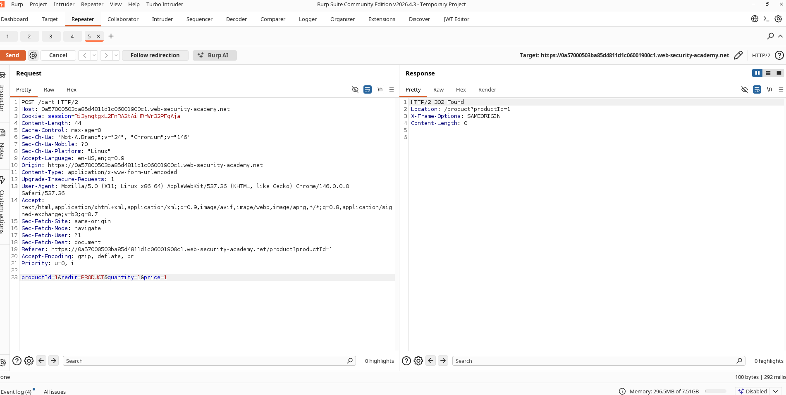

# How I Bought a $1337 Jacket for a Penny

## The Setup

I was working through the PortSwigger Web Security Academy business logic labs when I came across this one. It was rated **Apprentice** difficulty, and the goal was simple on paper: buy the **"Lightweight l33t leather jacket"** for a manipulated price by messing with a client-controlled parameter.

The lab URL was here: https://portswigger.net/web-security/logic-flaws/examples/lab-logic-flaws-excessive-trust-in-client-side-controls

---

## What I Was Up Against

I started by poking around the application to see what I was dealing with. The store looked normal enough, but something immediately caught my attention. When I added items to my cart, the price wasn't being calculated server-side. Instead, the application was trusting whatever price value the client sent along with the request.

That felt like a huge red flag. If the server wasn't validating or recalculating the price, I figured I could probably just tell it to charge me whatever I wanted.

---

## How I Found the Vulnerability

### Logging In

First things first, I logged in with the credentials provided by the lab:

```text
Username: wiener
Password: peter
```

Once I was in, I navigated to the online store and started looking around.

---

### Adding the Jacket to My Cart

I found the target product:

```text
Lightweight l33t leather jacket
```

I clicked **Add to Cart** and immediately fired up Burp Suite to intercept the request. I wanted to see exactly what was being sent to the server.

---

### Spotting the Vulnerable Parameter

I hopped over to Burp Suite's Proxy tab:

```text
Proxy → HTTP History
```

There it was, the request that caught my eye:

```http
POST /cart
```

The request body looked like this:

```http
productId=1&redir=PRODUCT&quantity=1&price=133700
```

I stared at that `price=133700` parameter for a second. The price was being sent by the client. The server was just accepting it. That was the vulnerability right there.

### Screenshot



---

## What I Did Next

### Sending the Request to Repeater

I right-clicked the request in Burp Suite and selected:

```text
Send to Repeater
```

This let me play around with the request without having to re-capture it every time.

---

### Changing the Price

Here's where it got fun. I changed:

```text
price=133700
```

to:

```text
price=1
```

So my modified request looked like:

```http
productId=1&redir=PRODUCT&quantity=1&price=1
```

I hit Send, and the server accepted it. No validation, no complaints, nothing. It just took my word for it.

### Screenshot



---

### Checking the Cart

I went back to the browser and refreshed my shopping cart. Sure enough, the jacket was now showing at my manipulated price:

```text
$0.01
```

The server had trusted the client-side price parameter completely. It didn't verify the actual product cost at all.

### Screenshot


---

### Completing the Purchase

Since the manipulated price was well below my available store credit, I just proceeded to checkout. I clicked:

```text
Place Order
```

And just like that, the purchase went through. I had successfully bought a $1337 jacket for a single cent.

### Screenshot


---

### Finishing the Lab

After the purchase completed, the lab marked itself as solved. That was it.

### Screenshot


---

## What Went Wrong Under the Hood

The root cause was straightforward. The application relied on a client-supplied parameter:

```http
price
```

to determine the final purchase amount.

Because the server failed to verify or recalculate the actual product price, I could manipulate the value and purchase items at arbitrary prices. It was a classic case of excessive trust in client-side controls.

---

## Why This Matters

If someone exploited this in a real application, they could:

- Purchase products at heavily discounted prices.
- Bypass intended payment restrictions.
- Cause financial losses.
- Manipulate transaction values.
- Abuse business logic for unauthorized gains.

---

## How to Fix It

Here is what I would recommend to prevent this kind of issue:

1. Never trust price-related values supplied by clients.
2. Calculate product prices exclusively on the server.
3. Ignore client-provided pricing parameters.
4. Validate order totals before checkout.
5. Implement server-side integrity checks for transactions.

---

## What I Learned

Security controls implemented solely on the client side can be bypassed. Sensitive values such as prices, discounts, balances, and permissions must always be validated and enforced on the server side. This lab was a perfect reminder of why server-side validation is non-negotiable.
