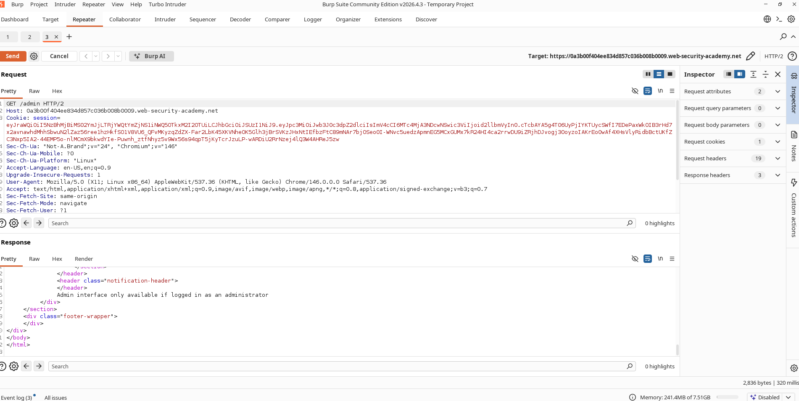
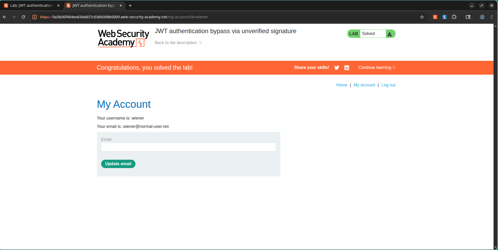

# Sneaking into the Admin Panel by Forging a JWT

## What Lab I Was Working On

**Category:** JWT Attacks
**Difficulty:** Apprentice
**Lab URL:** https://portswigger.net/web-security/jwt/lab-jwt-authentication-bypass-via-unverified-signature

## What I Needed to Do

I needed to exploit a JWT implementation flaw where the server was not verifying signatures. The plan was to modify the JWT payload so I could impersonate the administrator account, access the admin panel, and delete the user `carlos`.

---

## How I Found the Vulnerability

I started by logging in with valid credentials:

```text
Username: wiener
Password: peter
```

Then I navigated to:

```text
My Account
```

I captured the authenticated request and pulled out the JWT session cookie.

---

## Digging Into the JWT

I opened the request in Burp Suite and found the JWT sitting in the session cookie. After decoding it, the payload looked like this:

```json
{
  "iss": "portswigger",
  "exp": 1782074705,
  "sub": "wiener"
}
```

### Screenshot


---

## Hitting a Wall at the Admin Panel

I tried changing the request path to:

```http
GET /admin HTTP/2
```

I sent it with the original JWT, but the server came back with:

```http
401 Unauthorized
```

That made sense — I was logged in as wiener, not an admin.

### Screenshot



---

## Forging My Way In

I realized the server was not actually checking the JWT signature, so I decided to tamper with the payload. I changed the `sub` claim:

From:

```json
"sub": "wiener"
```

To:

```json
"sub": "administrator"
```

Because the app was skipping signature validation, it happily accepted the modified token.

---

## Access Granted

I resent the request:

```http
GET /admin HTTP/2
```

This time, the application let me right into the admin panel.

### Screenshot


---

## Deleting Carlos

Once inside, I found the delete endpoint:

```http
/admin/delete?username=carlos
```

I fired off the request, and Carlos was gone.

### Screenshot


---

## Mission Accomplished

After deleting Carlos, the lab confirmed it was solved.

### Screenshot



---

## What Went Wrong on the Server Side

The application trusted everything inside the JWT without validating the token signature. That let me change sensitive claims like:

```json
{
  "sub": "administrator"
}
```

without ever needing the signing key.

---

## The Damage This Could Do

If someone else found this, they could:

- Escalate privileges
- Impersonate arbitrary users
- Access administrative functionality
- Bypass authentication controls
- Perform unauthorized actions

---

## How to Fix It

1. Always verify JWT signatures before processing claims.
2. Reject unsigned tokens.
3. Reject tokens with modified payloads.
4. Use secure JWT libraries.
5. Restrict sensitive actions using server-side authorization checks.

---

## What I Learned

JWT contents should never be trusted unless the token signature has been validated. Failure to verify signatures lets attackers forge arbitrary identities and gain unauthorized access.
