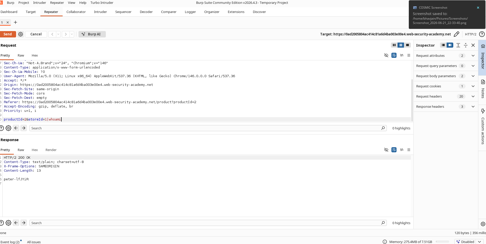
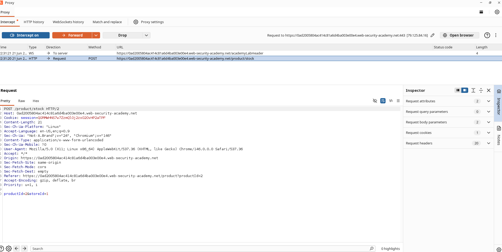

# A Pipe Character and a whoami Command

## What I Was Up Against

I jumped into the **OS Command Injection – Simple Case** lab, an Apprentice-level challenge from PortSwigger's Web Security Academy. The task was straightforward: find an OS command injection vulnerability and use it to run `whoami` so I could see which user account the web server was running under.

The vulnerable feature was the stock checker. I had a feeling the app was passing user input straight into a shell command without sanitizing it first.

---

## How I Found the Vulnerability

I opened a product page and clicked **Check Stock**. With Burp Suite intercepting traffic, I caught the request and sent it to Repeater. I started looking at the parameters, especially `storeId`. It looked like a simple numeric value, but I wondered what would happen if I treated it like part of a shell command.

---

## What I Did

I modified the `storeId` parameter by appending a pipe and the `whoami` command:

```text
1|whoami
```

I sent the request and waited to see what came back.

---

## What I Saw

The response included the output of the `whoami` command. I could see the exact username the web application was running as. That single pipe character turned a harmless inventory check into arbitrary command execution.

---

## The Screenshots

Here is the command execution in action:



And the lab solved confirmation:



---

## Why This Matters

This was a simple case, but the impact is anything but simple. Once you can inject shell commands, you can do things like:

- Steal information from the server
- Read files off the filesystem
- Grab credentials
- Achieve remote code execution
- Completely compromise the server

A single un-sanitized parameter is all it takes.

---

## How to Fix It

If I were the one patching this, I would recommend:

- Avoid invoking OS commands with user-controlled input
- Use safe APIs instead of shell execution
- Validate and sanitize all user input
- Implement allowlists for expected parameter values
- Run services with least-privileged accounts

---

## What I Learned

This lab drove home a point I already knew but loved seeing in practice: never pass user input directly into operating system commands. Even something as innocent-looking as a `storeId` parameter can become a weapon if proper input validation is not enforced. The pipe character `|` is small, but in the right context it opens the floodgates.
