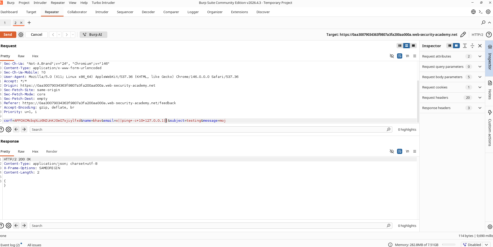
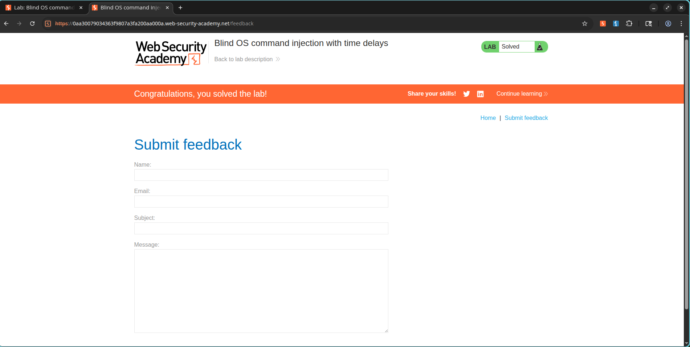

# Proving Blind Command Injection with a 10-Second Delay

## What I Was Up Against

Next up was the **Blind OS Command Injection with Time Delays** lab. This one was marked as Practitioner difficulty, and I quickly realized why. Unlike the previous command injection challenge, this app did not return command output in the HTTP response at all. I had to prove the vulnerability existed without being able to see the results directly.

The target was the feedback form. My goal was to confirm command execution by causing a measurable time delay.

---

## How I Found the Vulnerability

I opened the feedback form and submitted a normal request while Burp Suite was intercepting. I sent the request to Repeater and started poking at the parameters. The `email` field caught my attention. If the app was passing this value into a shell command behind the scenes, I could inject something that would create a side effect I could actually observe.

Since I could not see the command output, I decided to use time as my signal.

---

## The Payload I Chose

I modified the `email` parameter with this payload:

```text
x||ping+-c+10+127.0.0.1||
```

What this does under the hood is execute:

```bash
ping -c 10 127.0.0.1
```

That command sends ten ping packets to localhost. On most systems that takes roughly ten seconds to complete. If the server hung for about ten seconds before responding, I would know my command had been executed.

---

## What I Saw

I sent the modified request and started counting. The response took approximately ten seconds to come back, way longer than the normal near-instant reply. That delay was my proof.

Here is the original request for reference:


And the delayed response:



The lab immediately marked itself as solved.



---

## Why This Matters

Blind command injection is sneaky. Just because you cannot see the output does not mean the vulnerability is harmless. I could still:

- Execute arbitrary operating system commands
- Read sensitive files using out-of-band techniques
- Establish persistence
- Escalate privileges
- Take complete control of the affected server

Timing-based payloads like the one I used are a reliable way to verify and exploit blind injection issues.

---

## How to Fix It

The defenses here are standard but worth repeating:

- Avoid passing user-controlled input to shell commands
- Use safe APIs instead of shell execution
- Validate and sanitize all user input
- Apply allowlist validation wherever possible
- Run services with least privileges
- Monitor for unusual delays and command execution patterns

---

## What I Learned

This lab taught me to trust side effects when direct output is not available. A ten-second delay does not look like much on paper, but in the context of blind command injection it is a smoking gun. It also made me appreciate why monitoring for timing anomalies is important. If I were on the blue team, an unexpected ten-second delay on a feedback form submission would be worth investigating immediately.
