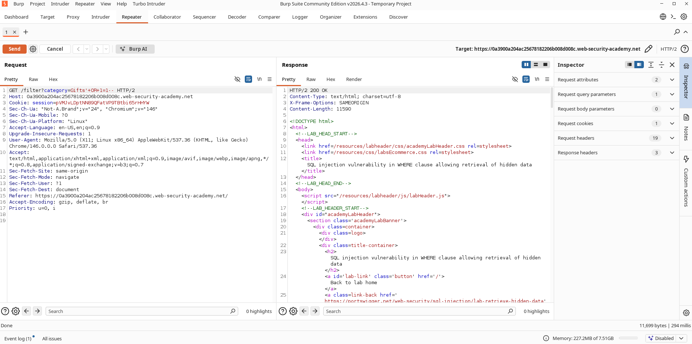

# How I Used a Simple `' OR 1=1--` to Pull Hidden Products from the Database

## What I Was Looking At

I started this lab by browsing the product listing page and noticed how the site filtered items by category. Whenever I clicked a category like "Gifts," the URL changed and the page reloaded with only those products. That got me thinking about what was happening on the backend. My hunch was that the application was taking my input and dropping it straight into a SQL query without any sanitization.

I figured the query probably looked something like this behind the scenes:

```sql
SELECT * FROM products WHERE category = 'Gifts' AND released = 1;
```

The `released = 1` part caught my attention. That meant there were probably products in the database that weren't meant to be visible yet. If I could break out of that query and change the logic, I might be able to see everything, including hidden items.

---

## What I Did

Here's exactly how I approached it step by step:

1. I navigated to the product listing page and picked a category.
2. I fired up Burp Suite and intercepted the request.
3. I sent the intercepted request over to Burp Repeater so I could play with it.
4. I found the `category` parameter in the request.
5. I changed the category value to:

```sql
' OR 1=1--
```

6. I sent the modified request.
7. The response came back packed with products from every category, including ones that were clearly not supposed to be public.

---

## Proof of Concept

### Payload I Used

```sql
' OR 1=1--
```

### What the Original Query Probably Looked Like

```sql
SELECT * FROM products
WHERE category = 'Gifts'
AND released = 1;
```

### What Happened After I Injected My Input

```sql
SELECT * FROM products
WHERE category = ''
OR 1=1--'
AND released = 1;
```

The `OR 1=1` part made the entire `WHERE` clause evaluate to true for every single row in the table. The `--` commented out the rest of the original query, so the `released = 1` check was completely ignored. That's why the server dumped everything back to me.

---

## Screenshots

### Screenshot 1 - Burp Suite Request and Response

**Purpose:** Demonstrates successful SQL Injection exploitation.

**Take Screenshot When:**

* The modified request containing `' OR 1=1--` is visible in Burp Repeater.
* The response shows products from multiple categories.

**Insert Screenshot Below**



---

### Screenshot 2 - Lab Solved Confirmation

**Purpose:** Demonstrates successful completion of the PortSwigger lab.

**Take Screenshot When:**

* The page displays:
  `Congratulations, you solved the lab!`

**Insert Screenshot Below**


---

## Why This Matters

This kind of vulnerability is more dangerous than it first appears. Here is what I realized could happen:

* Unauthorized access to hidden products.
* Exposure of unreleased or restricted information.
* Disclosure of business-sensitive data.
* Increased attack surface for further SQL Injection exploitation.
* Loss of confidentiality within the application.

---

## How I Would Fix It

If I were the one defending this application, here is what I would do:

1. Use parameterized queries (prepared statements) for all database interactions.
2. Validate and sanitize user-supplied input.
3. Implement server-side input validation.
4. Apply the principle of least privilege to database accounts.
5. Conduct regular security testing and code reviews.

---

## CVSS Score

**CVSS v3.1 Score:** 5.3 (Medium)

**Vector:**

```text
CVSS:3.1/AV:N/AC:L/PR:N/UI:N/S:U/C:L/I:N/A:N
```

---

## CVSS Justification

### Attack Vector

Network (N) – Exploitable remotely through HTTP requests.

### Attack Complexity

Low (L) – No special conditions are required.

### Privileges Required

None (N) – No authentication is required.

### User Interaction

None (N) – The attack can be performed directly.

### Scope

Unchanged (U) – Impact remains within the vulnerable application.

### Confidentiality Impact

Low (L) – Hidden product information can be disclosed.

### Integrity Impact

None (N) – No modification of data is performed.

### Availability Impact

None (N) – No denial of service or disruption occurs.
