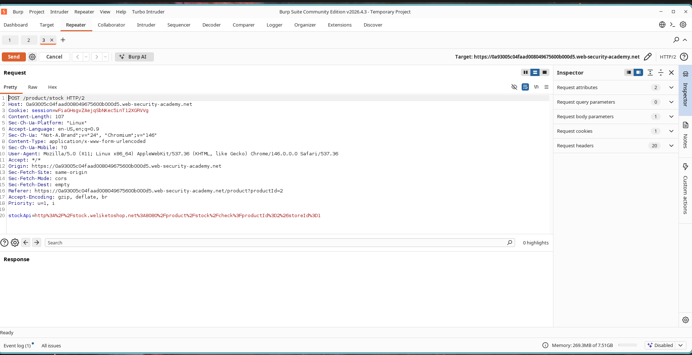

# How I Pivoted from a Stock Check to the Admin Panel

## What I Was Up Against

I was working through the PortSwigger Web Security Academy labs and picked up the **Basic SSRF Against the Local Server** challenge. It was labeled as Apprentice difficulty, so I figured it would be a good warm-up. The goal was pretty direct: exploit a Server-Side Request Forgery (SSRF) vulnerability to reach the internal administration panel and delete the user **carlos**.

The app had a stock-check feature that fetched data from an internal system. I had a hunch the URL it used was being passed straight through from user input without much validation. That is usually where SSRF lives.

---

## How I Found the Vulnerability

I started by opening a product page and clicking **Check Stock**. I had Burp Suite running in the background, so I intercepted the outgoing request and sent it over to Repeater for a closer look.

Right away I noticed the `stockApi` parameter:

```http
stockApi=http://stock.weliketoshop.net:8080/product/stock/check?productId=1&storeId=1
```

That URL looked completely user-controlled. If the server was willing to fetch whatever I put in there, I could probably make it talk to places it was not supposed to reach.



---

## What I Did Next

My first thought was simple: what happens if I point `stockApi` at `localhost` instead of the external stock server? I swapped the value out and fired the request:

```http
stockApi=http://localhost/admin
```

The response came back with the internal administration panel. I could not believe how easy that was. Right there in the HTML was a link for deleting users:

```html
/admin/delete?username=carlos
```


At this point I knew the app was blindly trusting the URL I gave it. The server happily made a request to its own admin interface on my behalf.

---

## The Exploit in Action

I modified the request one more time, this time targeting the delete endpoint directly:

```http
stockApi=http://localhost/admin/delete?username=carlos
```

I sent it and watched the server perform the action. No extra auth step, no IP restriction. Just a single manipulated parameter and **carlos** was gone.


A second later the lab updated itself and showed the green solved banner.


---

## Why This Matters

What I just did in a controlled lab is exactly what happens in the real world when SSRF is left unpatched. I was able to:

- Access an internal admin interface from the outside
- Interact with services that should only be reachable from localhost
- Bypass any network-level firewall rules because the request came from the server itself
- Perform a privileged action (user deletion) without authentication

In production environments, SSRF is often a pivot point that leads to full infrastructure compromise.

---

## How to Fix It

If I were defending this app, here is what I would push for:

1. Implement strict allowlists for outbound requests
2. Block access to localhost and private IP ranges
3. Restrict access to internal services
4. Validate and sanitize every user-supplied URL
5. Use network segmentation
6. Disable unnecessary outbound connections

---

## What I Learned

This lab reminded me that the simplest vulnerabilities are often the most dangerous. The stock-check feature was doing exactly what it was supposed to do, fetch a remote resource, except it never stopped to ask whether it should. By changing one parameter I went from a normal user checking inventory to someone deleting accounts on an admin panel. That is the power of SSRF, and it is why input validation on outbound URLs is non-negotiable.
